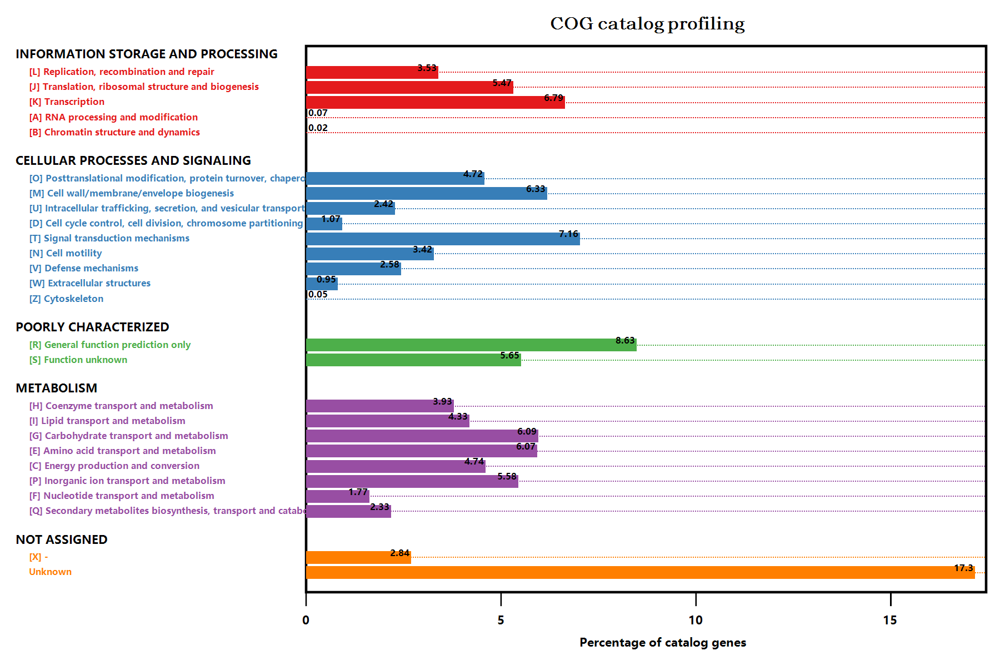
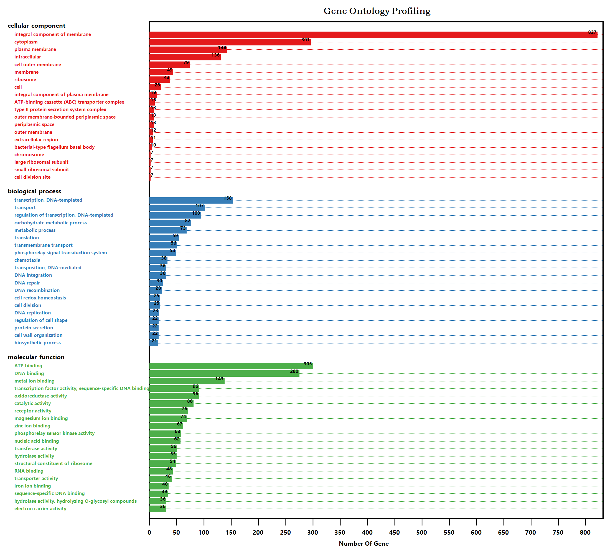
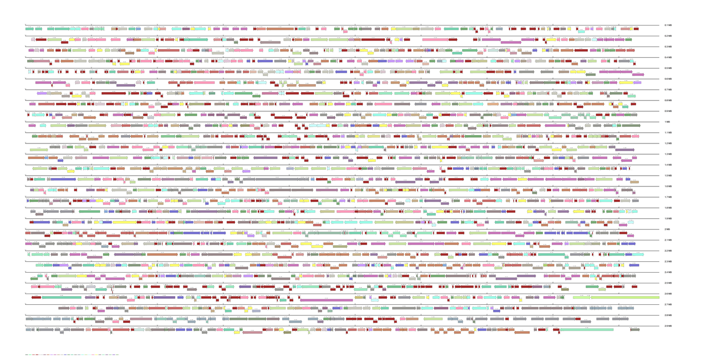
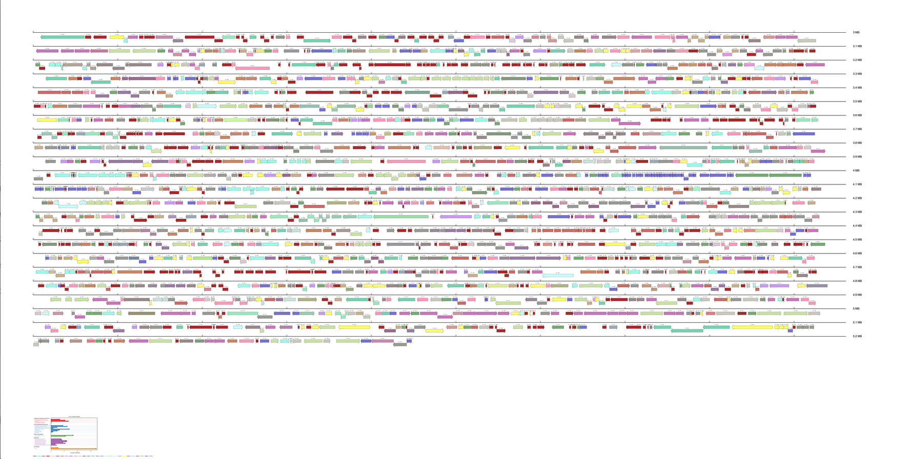
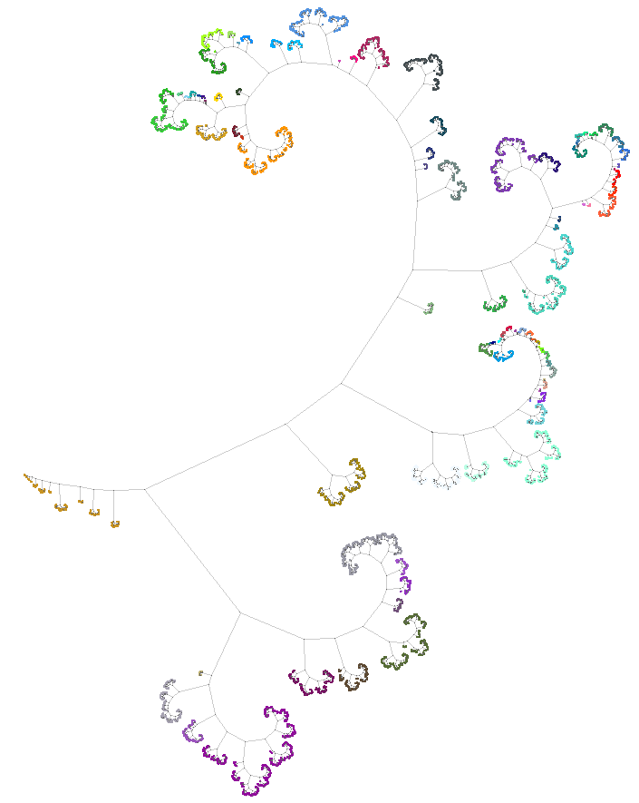

**[Xanthomonas campestris pv. campestris 8004]** GCModeller genomics Modelling Project

> It is recommended that you can using this project as the GCModeller demo &amp; tutorials

### DataSource

+ NCBI genbank data: [Xanthomonas campestris pv. campestris str. 8004, complete genome](https://www.ncbi.nlm.nih.gov/nuccore/66571684/)
+ NCBI ftp directory:
+ RNA-seq data from public database:

### Directory Roadmap

+ **./genbank**: NCBI genbank annotation information
+ **[./genome](./genome)**: GCModeller genomics annotation result
   + ``./genome/circos/``: circos plot of the genome.
   + ``./genome/chromsome-map/``: chromsome map plot of the bacterial genome.
   + [``./genome/COG/``](./genome/COG/index.md): The COG annotation sbh result.
+ **[./pathway](./pathway)**: GCModeller Pathway network model
+ **[./proteome](./proteome)**:

### Data Figures

###### Xcc8004 genome function

###### genome map plot

> View detail in [./genome/chromsome-map/](./genome/chromsome-map/)

###### promoter region palindrome cluster tree

## References

